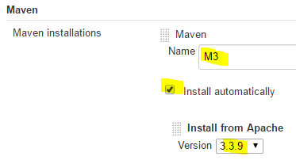

<!-- TOC depthFrom:1 depthTo:6 withLinks:1 updateOnSave:1 orderedList:0 -->

- [Summary](#summary)
	- [job1: test1](#job1-test1)
	- [job2: test2](#job2-test2)
- [Run Jenkins Server](#run-jenkins-server)
	- [Install Jenkins](#install-jenkins)
	- [Start Jenkins](#start-jenkins)
	- [Initialize Jenkins](#initialize-jenkins)
		- [Get init password](#get-init-password)
		- [Init](#init)
- [Install Jenkins Plugins](#install-jenkins-plugins)
- [Config Global Tool](#config-global-tool)
- [job 1: test1](#job-1-test1)
	- [config git project](#config-git-project)
	- [config build env](#config-build-env)
	- [add build step](#add-build-step)
		- [build maven project](#build-maven-project)
		- [archive the artifacts](#archive-the-artifacts)
	- [build result](#build-result)
- [job 2: test2](#job-2-test2)
	- [config build env](#config-build-env)
	- [add build step](#add-build-step)
	- [build result](#build-result)

<!-- /TOC -->

# Summary

run two job: `test1` and `test2`

## job1: test1
```
- build java project in docker container with maven
- archive build result
```

## job2: test2
```
- copy build result of test1 to container of test2
- ls build result
```

# Run Jenkins Server

>latest version: `2.7.2`

## Install Jenkins
```
//method1
$ sudo wget -O /etc/yum.repos.d/jenkins.repo http://pkg.jenkins-ci.org/redhat-stable/jenkins.repo
$ sudo rpm --import https://jenkins-ci.org/redhat/jenkins-ci.org.key
$ sudo yum install jenkins
$ sudo service jenkins start

//method2
$ sudo yum install -y http://pkg.jenkins-ci.org/redhat-stable/jenkins-2.7.2-1.1.noarch.rpm
```
## Start Jenkins

```
$ sudo service jenkins start
```

## Initialize Jenkins

### Get init password
```
$ sudo grep 'assword' -C2  /var/log/jenkins/jenkins.log
*************************************************************

Jenkins initial setup is required. An admin user has been created and a password generated.
Please use the following password to proceed to installation:

0db328ce8ae94dbb8c71c75541ded1b3

This may also be found at: /var/lib/jenkins/secrets/initialAdminPassword

*************************************************************


```

### Init

```
//Open `http://<host-ip>:8080` in WebBrowser
...
```

# Install Jenkins Plugins

```
Manage Jenkins -> Manage Plugins -> Available
```
- [CloudBees Docker Custom Build Environment Plugin](https://wiki.jenkins-ci.org/display/JENKINS/CloudBees+Docker+Custom+Build+Environment+Plugin)
- [Copy To Slave Plugin](https://wiki.jenkins-ci.org/display/JENKINS/Copy+To+Slave+Plugin)
- [Copy Artifact Plugin](https://wiki.jenkins-ci.org/display/JENKINS/Copy+Artifact+Plugin)
- Archive the artifacts


# Config Global Tool

Manage Jenkins -> Global Tool Configuration -> Add Maven  


# job 1: test1

- build project `https://github.com/ciandcd/JavaHelloWorld.git` with maven in docker container
- archive the build result `target/HelloWorld-1.0-SNAPSHOT-javadoc.jar`

## config git project  


## config build env  


## add build step

### build maven project


### archive the artifacts


## build result


# job 2: test2

- Build Environment -> Build inside a Docker container
- Build -> Copy artifacts from another project

## config build env  


## add build step


## build result

