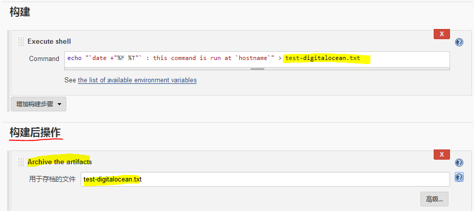

Jenkins中的文件复制
==================

本文档是关于Jenkins插件`Copy To Slave Plugin`和`Copy Artifact Plugin`，以及Jenkins内建的`Archive the artifacts`功能的用法。

<!-- TOC depthFrom:1 depthTo:6 withLinks:1 updateOnSave:1 orderedList:0 -->

- [1.Jenkins job相关目录](#1jenkins-job相关目录)
- [2.文件复制类型](#2文件复制类型)
- [3.示例](#3示例)
	- [3.1 工作目录→归档目录（Archive the artifacts-内建功能）](#31-工作目录归档目录archive-the-artifacts-内建功能)
		- [3.1.1示意图](#311示意图)
		- [3.1.2 job配置](#312-job配置)
		- [3.1.3 job构建结果](#313-job构建结果)
		- [3.1.4 job归档目录](#314-job归档目录)
	- [3.2 归档目录→工作目录（Copy Artifact Plugin）](#32-归档目录工作目录copy-artifact-plugin)
		- [3.2.1 示意图](#321-示意图)
		- [3.2.2 job配置](#322-job配置)
		- [3.2.3 job构建结果](#323-job构建结果)
	- [3.3 slave工作目录→master工作目录(Copy To Slave Plugin)](#33-slave工作目录master工作目录copy-to-slave-plugin)
		- [3.3.1 示意图](#331-示意图)
		- [3.3.2 Job配置](#332-job配置)
		- [3.3.3 job构建结果](#333-job构建结果)
		- [3.3.4 Job工作目录](#334-job工作目录)

<!-- /TOC -->

# 1.Jenkins job相关目录

每个job分`工作目录`和`归档目录`
- **工作目录**：可以在master节点(`本地构建`)，也可以在slave节点(`分布式构建`)
- **归档目录**：只在master节点

工作目录跟随build环境，如果slave节点删除，则工作目录随之消失。
归档目录一直保存在master环境（直到删除job）。

如下图所示：


# 2.文件复制类型

- `工作目录` → `归档目录`： Archive the artifacts（Jenkins内建功能）
- `归档目录` → `工作目录`： Copy Artifact Plugin
- `slave工作目录` → `master工作目录`： Copy To Slave Plugin


# 3.示例

## 3.1 工作目录→归档目录（Archive the artifacts-内建功能）

### 3.1.1示意图


job_1本地构建, job_2分布式构建。
通过jenkins内建的“Archive the artifacts”功能，可以从`工作目录`复制指定文件到`master的归档目录`。

### 3.1.2 job配置

如下所示为job（test-digitalocean）的配置



### 3.1.3 job构建结果


### 3.1.4 job归档目录

以下为build完成后，master上的归档目录及文件
```
root@60aaf8d60c4d:/# cat /var/jenkins_home/jobs/test-digitalocean/builds/lastStableBuild/archive/test-digitalocean.txt
2016-07-12 11:59:45 : this command is run at jenkins-test-centos-3ae3e088-d61d-4bf4-8321-570d2f97d279
```


## 3.2 归档目录→工作目录（Copy Artifact Plugin）

### 3.2.1 示意图


job_1在构建时，可以通过`Copy Artifact Plugin`插件，从`job_2的归档目录`，复制文件到`job_1的工作目录`

### 3.2.2 job配置
如下所示为job（test-digitalocean-2）的配置：


- **第1个buid step** （扩展自Copy Artifact Plugin）
  从另一个job(`test-digitalocean`)的`归档目录`中，复制test-digitalocean.txt文件到当前job(`test-digitalocean-2`)的`工作目录`中。
- **第2个build step**
  读取这个复制过来的文件。

### 3.2.3 job构建结果


## 3.3 slave工作目录→master工作目录(Copy To Slave Plugin)

### 3.3.1 示意图


### 3.3.2 Job配置
如下所示为job（test-digitalocean-2）的配置


构建后操作`Copy files back to job’s workspace on the master node`，可以把当前`工作目录`下的指定文件，复制到master上对应的`工作目录`下。

### 3.3.3 job构建结果


### 3.3.4 Job工作目录
build完成后，master上的工作目录:
```
root@60aaf8d60c4d:/# ls -l /var/jenkins_home/workspace/test-digitalocean-2
total 4
-rw-r--r-- 1 root root 157 Jul 12 14:06 test-digitalocean-2.txt
```
