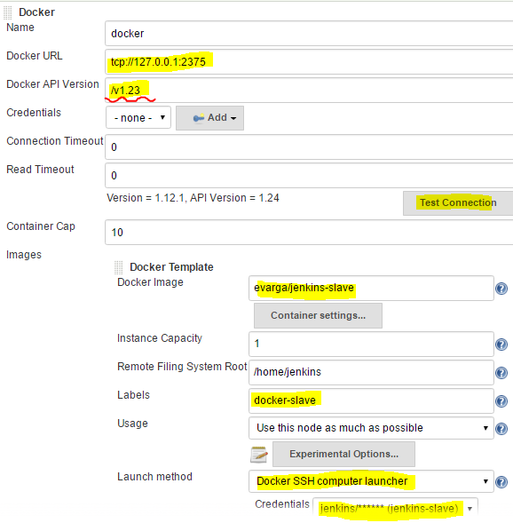
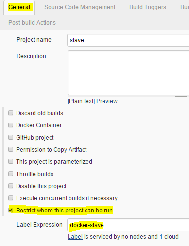
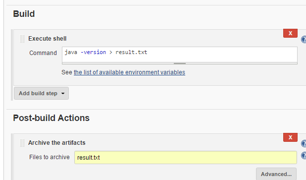
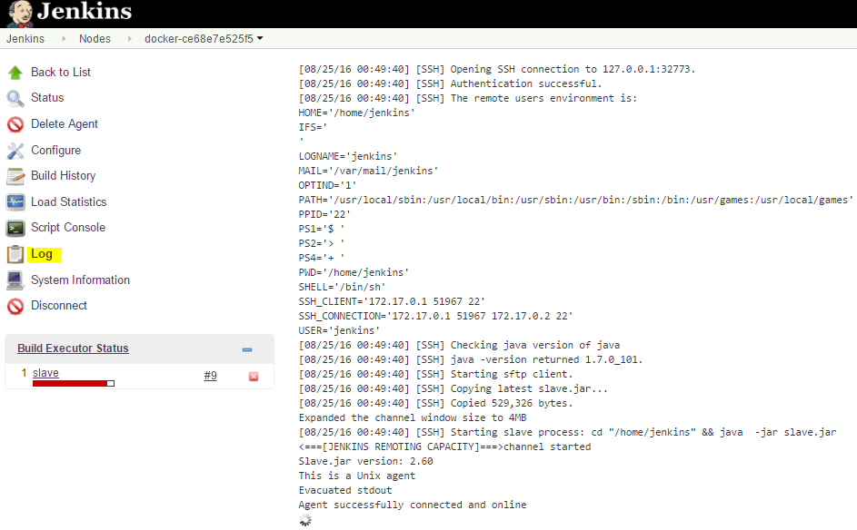
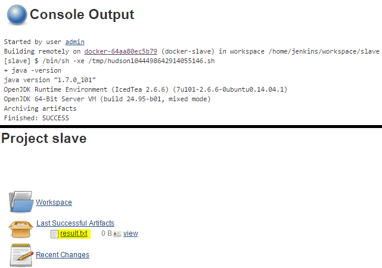

usage of docker-plugin/yet-another-docker-plugin
================================================

# Dependency
- CentOS Linux release 7.2.1511
- Java 8
- Jenkins 2.7.2
- Docker 1.12.1

# Install dependency
[Installation](doc/install.md)

# Faq
if docker-plugin doesn't support docker 1.12, then see
[Faq](doc/faq.md)

# config

## global config

- defaut account of 'evarga/jenkins-slave': jenkins/jenkins
- Docker API Version: /v1.23

## job config

Set "Label Expression"  

Config Build Step

## node log

## build log

