Visualize plugin execution flow with Flow Visual Tracer
=======================================================

<!-- TOC depthFrom:1 depthTo:6 withLinks:1 updateOnSave:1 orderedList:0 -->

- [Dependency](#dependency)
- [Prepare](#prepare)
	- [Flow Visual Tracer](#flow-visual-tracer)
		- [Download flow.zip](#download-flowzip)
		- [Start Flow Visual Tracer](#start-flow-visual-tracer)
		- [Open Flow Web UI](#open-flow-web-ui)
	- [docker-slaves-plugin](#docker-slaves-plugin)
		- [Get plugin code](#get-plugin-code)
		- [Start Jenkins Server](#start-jenkins-server)
		- [Open Jenkins Web UI](#open-jenkins-web-ui)
	- [Check Flow Web](#check-flow-web)
- [Usage](#usage)
	- [Config docker-slaves-plugin](#config-docker-slaves-plugin)
	- [Create and config new job](#create-and-config-new-job)
	- [Start record](#start-record)
	- [Build job](#build-job)
	- [Stop recode](#stop-recode)
	- [View flow diagram](#view-flow-diagram)
		- [Package view](#package-view)
		- [Class view](#class-view)
		- [Method view](#method-view)

<!-- /TOC -->

# Dependency

- jdk 1.7+
- maven 3+
- [flow.zip](http://com.flow.launcher.s3-website-eu-west-1.amazonaws.com/flow.zip)  ( from http://findtheflow.io)
- [docker-slaves-plugin](https://github.com/Jimmy-Xu/docker-slaves-plugin)(fork version)

# Prepare

## Flow Visual Tracer

### Download flow.zip

size of flow.zip is `120MB`

```bash
$ mkdir ~/java-flow
$ cd ~/java-flow
$ wget -c http://com.flow.launcher.s3-website-eu-west-1.amazonaws.com/flow.zip -O flow.zip
$ unzip flow.zip
```

### Start Flow Visual Tracer
```bash
$ ./flow
Java HotSpot(TM) 64-Bit Server VM warning: ignoring option MaxPermSize=256m; support was removed in 8.0
Starting Flow...
Flow is ready on http://app.findtheflow.io (Ctrl+C to stop it)
```

### Open Flow Web UI
open http://app.findtheflow.io in Web Browser of the same host.  
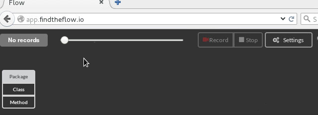

if flow not run, the the following warning message will occur:  
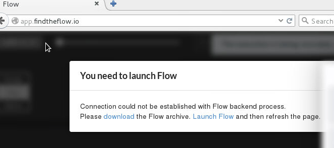


## docker-slaves-plugin

use fork version of docker-slaves-plugin: https://github.com/Jimmy-Xu/docker-slaves-plugin

### Get plugin code
```bash
$ cd ~
$ git clone https://github.com/Jimmy-Xu/docker-slaves-plugin.git -b hyper-driver
$ cd docker-slaves-plugin
```

### Start Jenkins Server

before start `Jenkins Server`, the `./flow` should be already running.

```bash
$ export MAVEN_OPTS="-javaagent:${HOME}/java-flow/flowagent.jar -Dflow.agent.include=it.dockins.dockerslaves,it.dockins.dockerslaves.api,it.dockins.dockerslaves.drivers,it.dockins.dockerslaves.pipeline,it.dockins.dockerslaves.spec,it.dockins.dockerslaves.spi"

$ mvn hpi:run
...
INFO: Completed initialization
Jul 20, 2016 7:58:34 PM hudson.WebAppMain$3 run
INFO: Jenkins is fully up and running

```

### Open Jenkins Web UI

open `http://<host_ip>:8080/jenkins` in Web Browser

## Check Flow Web

When `Jenkins Server` is running, the `Record` button on http://app.findtheflow.io will be `enabled`, this means  the preparatory work have been completed.  
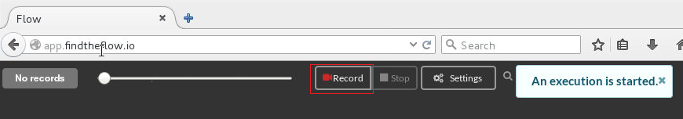


# Usage

## Config docker-slaves-plugin

Manage Jenkins -> Configure System -> Docker Slaves  
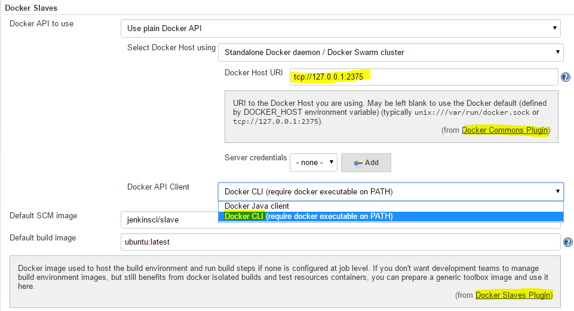

## Create and config new job

click "New Item" in Jenkins Web UI  


## Start record

click `Record` button in http://app.findtheflow.io  
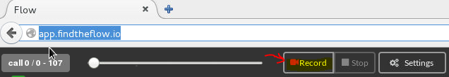

then it will enter recording mode  
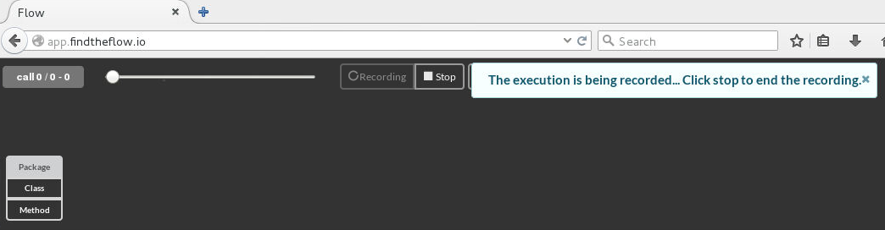


## Build job

trigger `build` job in Jenkins  
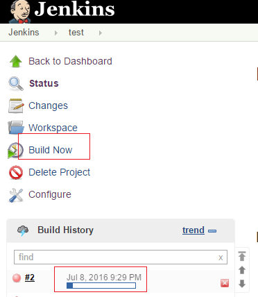

## Stop recode

After jenkins job finished, click `Stop` button in http://app.findtheflow.io  
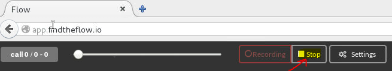

## View flow diagram

After click `Stop` button, the flow will be generated automatically. http://app.findtheflow.io

### Package view
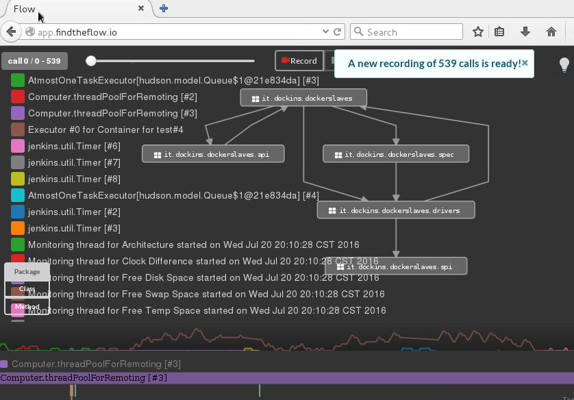

### Class view
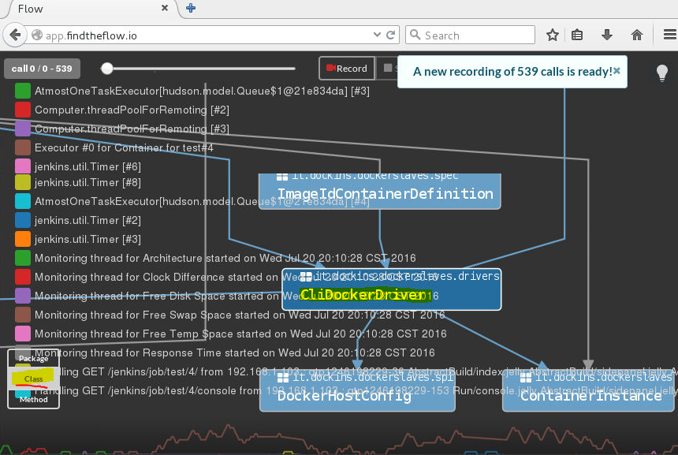

### Method view
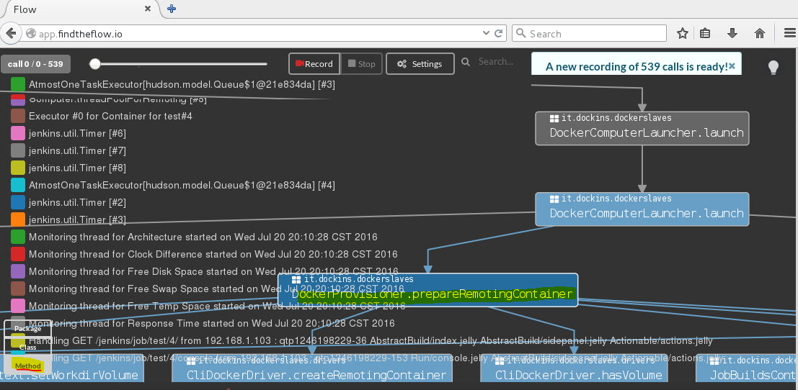
