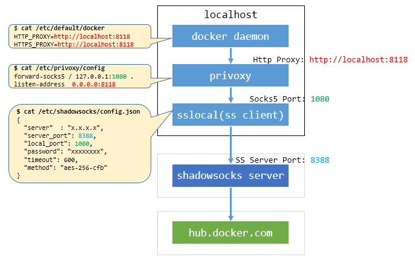

Use shadowsocks and privoxy
===========================

<!-- TOC depthFrom:1 depthTo:6 withLinks:1 updateOnSave:1 orderedList:0 -->

- [Solution](#solution)
- [Use shadowsocks](#use-shadowsocks)
	- [Install shadowsocks](#install-shadowsocks)
	- [Config shadowsocks](#config-shadowsocks)
	- [Config sslocal](#config-sslocal)
	- [Restart sslocal service](#restart-sslocal-service)
- [Use privoxy](#use-privoxy)
	- [Install privoxy](#install-privoxy)
	- [Config privoxy](#config-privoxy)
	- [Restart privoxy service](#restart-privoxy-service)
- [User Proxy](#user-proxy)

<!-- /TOC -->

# Solution

Use shadowsocks to provide socks5 proxy.
User privoxy to convert socks5 proxy to http proxy.

- shadowsocks local service port: `1080`
- privoxy local service port: `8118`



> if you want to run a shadowsocks server, please see this blog [Deploy a private shadowsocks container in 3 steps](https://blog.hyper.sh/deploy-a-private-shadowsocks-container-in-3-steps.html)


# Use shadowsocks

## Install shadowsocks

```
//centos
$ sudo yum install python-pip
$ sudo pip install shadowsocks

//ubuntu
$ sudo apt-get install python-pip
$ sudo pip install shadowsocks
$ sudo ln -s /usr/local/bin/sslocal /usr/bin/sslocal
```

## Config shadowsocks

please replace `server` and `server_port`

```
$ cat /etc/shadowsocks/config.json
{
  "server"  : "x.x.x.x",
  "server_port": 8388,
  "local_port": 1080,
  "password": "xxxxxxxx",
  "timeout": 600,
  "method": "aes-256-cfb"
}
```

## Config sslocal

```
$ cat /lib/systemd/system/sslocal.service
[Unit]
Description=Daemon to start Shadowsocks Client
Wants=network-online.target
After=network.target

[Service]
Type=simple
ExecStart=/usr/bin/sslocal -c /etc/shadowsocks/config.json --pid-file /var/run/sslocal.pid --log-file /var/log/sslocal.log

[Install]
WantedBy=multi-user.target
```

## Restart sslocal service

```
//reload systemd
$ sudo systemctl daemon-reload

//restart service
$ service sslocal restart

//enable service autostart
$ sudo systemctl enable sslocal

//check service
$ sudo service sslocal status
```

# Use privoxy

## Install privoxy

```
//centos
$ sudo yum install privoxy

//ubuntu
$ sudo apt-get install privoxy
```

## Config privoxy

```
$ sudo cat /etc/privoxy/config
forward-socks5 / 127.0.0.1:1080 .
listen-address  0.0.0.0:8118
```

## Restart privoxy service

```
$ sudo service privoxy restart

//check service
$ sudo service privoxy status
```

# User Proxy

```
//add the following lines to ~/.bashrc
$ cat >> ~/.bashrc <<EOF
export http_proxy=http://127.0.0.1:8118
export https_proxy=https://127.0.0.1:8118
EOF

$ source ~/.bashrc

//test
$ curl www.google.com
```
