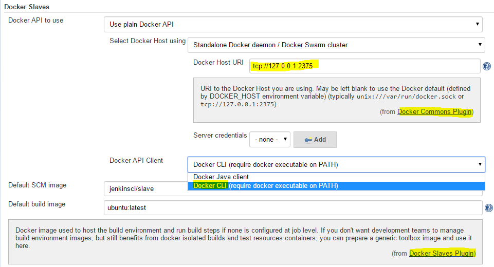

Use docker-slaves-plugin
========================

This doc will show the usage of docker-slaves-plugin.

<!-- TOC depthFrom:1 depthTo:6 withLinks:1 updateOnSave:1 orderedList:0 -->

- [Prepare](#prepare)
	- [Get source of plugin](#get-source-of-plugin)
	- [Modify maven config](#modify-maven-config)
	- [Build plugin from source](#build-plugin-from-source)
	- [Start Jenkins Server for dev](#start-jenkins-server-for-dev)
	- [Open Jenkins Web UI](#open-jenkins-web-ui)
- [Plugin usage](#plugin-usage)
	- [Plugin settings](#plugin-settings)
		- [Check installed plugin](#check-installed-plugin)
		- [Config plugin](#config-plugin)
	- [Job settings](#job-settings)
		- [Create job](#create-job)
		- [Config job](#config-job)
		- [Build job](#build-job)
		- [View build result](#view-build-result)
- [Reference](#reference)

<!-- /TOC -->

# Prepare

## Get source of plugin
```
$ git clone https://github.com/Dockins/docker-slaves-plugin.git
```

## Modify maven config

**change**

```
<dependency>
    <groupId>org.jenkins-ci.plugins</groupId>
    <artifactId>docker-java-api</artifactId>
    <version>3.0.0-SNAPSHOT</version>
    <optional>true</optional>
</dependency>
```

**to**

```
<dependency>
    <groupId>com.github.docker-java</groupId>
    <artifactId>docker-java</artifactId>
    <version>3.0.0</version>
</dependency>
```

## Build plugin from source
```
//compile source only
$ mvn compile

//generate target/docker-slaves.hpi
$ mvn package -DskipTests
```

## Start Jenkins Server for dev
```
$ mvn hpi:run
```

## Open Jenkins Web UI
```
open http://127.0.0.1:8080/jenkins in Web Browser
```


# Plugin usage

## Plugin settings

### Check installed plugin
```
Manage Jenkins -> Manage Plugins -> Installed -> "Docker Slaves Plugin"
```


### Config plugin
```
Manage Jenkins -> Configure System -> Docker Slaves
  -> Docker Host URI  : tcp://127.0.0.1:2375(example)
  -> Docker API Client: Docker CLI
```



## Job settings

### Create job


### Config job

Run the build inside Docker containers


Add Build Step


> to copy file from slave to master, please install jenkins plugin [ copy-to-slave-plugin](https://wiki.jenkins-ci.org/display/JENKINS/Copy+To+Slave+Plugin)


### Build job


Every build will executre with at least 2 containers :
- a plumbing 'jenkins-slave' container to run required Jenkins slave agent
- user's build container

```
$ docker ps
CONTAINER ID    IMAGE             COMMAND                  CREATED         STATUS        PORTS   NAMES
6f1518d9b071    busybox           "/trampoline wait"       3 seconds ago   Up 2 seconds          dreamy_darwin
b899096281c0    jenkinsci/slave   "java -Djava.io.tmpdi"   8 seconds ago   Up 7 seconds          grave_mclean
```

after finish build, these two container will be all removed.

### View build result

Build status


Docker Build Context


Console Output


# Reference

- **youtube** [Docker Slaves Plugin demos](https://www.youtube.com/watch?v=HbwgN0UTTxo)
- **blog**  [Docker Slaves Jenkins plugin has been released !](http://blog.loof.fr/2016/04/docker-slaves-jenkins-plugin-has-been.html)
- **Wiki** [Docker Slaves Plugin](https://wiki.jenkins-ci.org/display/JENKINS/Docker+Slaves+Plugin)
- **github** [Dockins/docker-slaves-plugin](https://github.com/Dockins/docker-slaves-plugin)
