Jenkins插件开发
==============

# 开发环境需求

- IntelliJ IDEA Community 2016.1.3+:
 - [下载](https://www.jetbrains.com/idea/download)
- Java SDK 8:
 - [下载](http://www.oracle.com/technetwork/java/javase/downloads)
- Apache Maven 3+:
 - [下载](https://maven.apache.org/download.cgi)
 - [安装指导](https://maven.apache.org/install.html)

# 检查环境

`To develop a plugin, you need Maven 3 and JDK 6.0 or later.`

## 检查JDK
```
$ java -version
java version "1.8.0_92"
Java(TM) SE Runtime Environment (build 1.8.0_92-b14)
Java HotSpot(TM) 64-Bit Server VM (build 25.92-b14, mixed mode)
```

## 检查Maven
```
$ mvn --version
Apache Maven 3.3.9 (bb52d8502b132ec0a5a3f4c09453c07478323dc5; 2015-11-11T00:41:47+08:00)
Maven home: D:\apache-maven-3.3.9\bin\..
Java version: 1.8.0_74, vendor: Oracle Corporation
Java home: D:\Program Files\Java\jdk1.8.0_74\jre
Default locale: zh_CN, platform encoding: GBK
OS name: "windows 10", version: "10.0", arch: "amd64", family: "dos"
```

# 开发步骤

REF: [Jenkins插件开发官方教程](https://wiki.jenkins-ci.org/display/JENKINS/Plugin+tutorial)

## 步骤1: 设置Maven环境

add the following to your `~/.m2/settings.xml` (Windows users will find them in `%USERPROFILE%\.m2\settings.xml`):
```
<settings>
  <pluginGroups>
    <pluginGroup>org.jenkins-ci.tools</pluginGroup>
  </pluginGroups>

  <profiles>
    <!-- Give access to Jenkins plugins -->
    <profile>
      <id>jenkins</id>
      <activation>
        <activeByDefault>true</activeByDefault> <!-- change this to false, if you don't like to have it on per default -->
      </activation>
      <repositories>
        <repository>
          <id>repo.jenkins-ci.org</id>
          <url>http://repo.jenkins-ci.org/public/</url>
        </repository>
      </repositories>
      <pluginRepositories>
        <pluginRepository>
          <id>repo.jenkins-ci.org</id>
          <url>http://repo.jenkins-ci.org/public/</url>
        </pluginRepository>
      </pluginRepositories>
    </profile>
  </profiles>
  <mirrors>
    <mirror>
      <id>repo.jenkins-ci.org</id>
      <url>http://repo.jenkins-ci.org/public/</url>
      <mirrorOf>m.g.o-public</mirrorOf>
    </mirror>
  </mirrors>
</settings>
```

## 步骤2: 生成插件框架

命令行下执行：
```
$ mvn -U org.jenkins-ci.tools:maven-hpi-plugin:create
```  
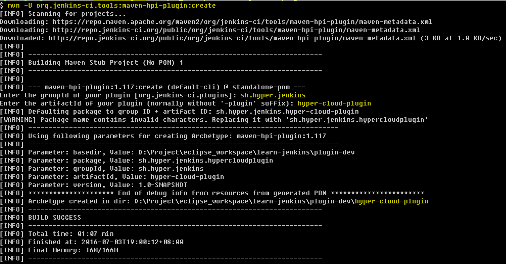

生成后的插件框架由如下部分组成:
- pom.xml
- src/main/java
- src/main/resources
- src/main/webapp

### pom.xml
Maven使用pom.xml来构建插件.所有Jenkins插件都基于如下POM：
```
<parent>
    <groupId>org.jenkins-ci.plugins</groupId>
    <artifactId>plugin</artifactId>
    <version>2.3</version>
</parent>
```

### src/main/java
插件的Java源码

### src/main/resources
插件的Jelly/Groovy视图

### src/main/webapp
插件的静态资源，例如图像或者HTML文件


## 步骤3：IntelliJ IDEA中打开项目

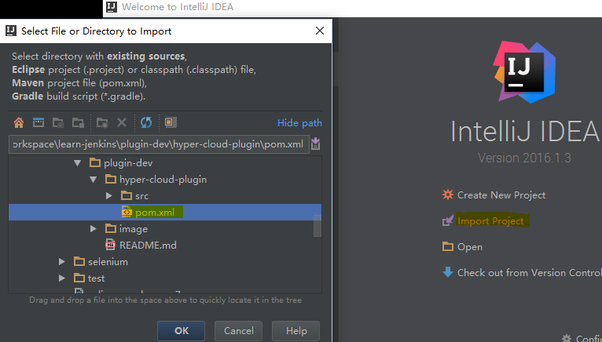
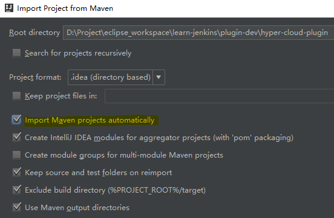
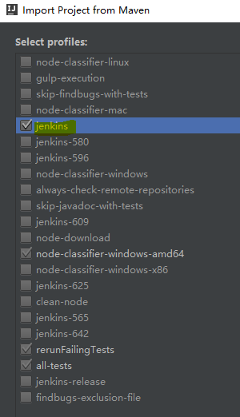
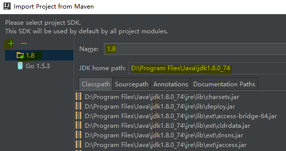


## 步骤4: 修改pom.xml
修改如下
```
<name>TODO Plugin</name>
<description>TODO</description>
<url>https://wiki.jenkins-ci.org/display/JENKINS/TODO+Plugin</url>
```
为
```
<name>Hyper_ Cloud Plugin</name>
<description>Hyper_ Cloud Plugins for Jenkins</description>
<url>https://wiki.jenkins-ci.org/display/JENKINS/Hyper_+Cloud+Plugin</url>
```

修改如下
```
  <jenkins.version>1.625.3</jenkins.version>
  <java.level>7</java.level>
```
为
```
<jenkins.version>2.11</jenkins.version>
<java.level>8</java.level>
```


> 修改pom.xml后，若IntelliJ IDEA弹出如下提示，则点击"Enable Auto-Import"  
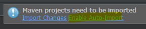


## 步骤5: 测试编译，打包及安装

- 编译：`mvn compile`
- 打包：`mvn package`
- 安装：`mvn install`

### 编译

编译但不生成结果
```
$ mvn compile
...
[INFO] ------------------------------------------------------------------------
[INFO] Building Hyper_ Cloud Plugin 1.0-SNAPSHOT
[INFO] ------------------------------------------------------------------------
...
[INFO] ------------------------------------------------------------------------
[INFO] BUILD SUCCESS
[INFO] ------------------------------------------------------------------------
```

### 打包

在`mvn compile`基础上，多了生成`*.hpi`文件到项目的`target`子目录下
```
$ mvn package
...
[INFO] --- maven-hpi-plugin:1.115:hpi (default-hpi) @ hyper-cloud-plugin ---
[INFO] Generating hpi D:\Project\eclipse_workspace\learn-jenkins\plugin-dev\hyper-cloud-plugin\target\hyper-cloud-plugin.hpi
[INFO] Building jar: D:\Project\eclipse_workspace\learn-jenkins\plugin-dev\hyper-cloud-plugin\target\hyper-cloud-plugin.hpi
...
```

### 安装

在`mvn package基础上`，多了复制`hpi`到本地仓库下：
```
$ mvn install
...
[INFO] --- maven-install-plugin:2.5.2:install (default-install) @ hyper-cloud-plugin ---
[INFO] Installing D:\Project\eclipse_workspace\learn-jenkins\plugin-dev\hyper-cloud-plugin\target\hyper-cloud-plugin.hpi to C:\Users\xjimm\.m2\repository\sh\hyper\jenkins\hyper-cloud-plugin\1.0-SNAPSHOT\hyper-cloud-plugin-1.0-SNAPSHOT.hpi
...
```


## 调试插件

使用`mvn hpi:run`可以启动一个本地Jenkins Server，以便于开发调试.

### 启动Jenkins服务

设置环境变量`MAVEN_OPTS`
```
//windows
$ set MAVEN_OPTS="-Xdebug -Xrunjdwp:transport=dt_socket,server=y,address=8000,suspend=n"
//linux
$ export MAVEN_OPTS="-Xdebug -Xrunjdwp:transport=dt_socket,server=y,address=8000,suspend=n"
```

如果`pom.xml`中，`jenkins.version`指定为`1.651.3`
```
$ mvn hpi:run
...
[INFO] Started SelectChannelConnector@0.0.0.0:8080
[INFO] Started Jetty Server
[INFO] Console reloading is ENABLED. Hit ENTER on the console to restart the context.
Started initialization
: Listed all plugins
: Prepared all plugins
: Started all plugins
: Augmented all extensions
: Loaded all jobs
: Started SSHD at port 64524
: Started Download metadata
: Completed initialization
: Jenkins is fully up and running
...
```

如果`pom.xml`中，`jenkins.version`指定为`2.11`
```
$ mvn hpi:run
...
Jenkins initial setup is required. An admin user has been created and a password generated.
Please use the following password to proceed to installation:

1bd3445dcaa7493b910fa63811f615b8

This may also be found at: D:\Project\eclipse_workspace\learn-jenkins\plugin-dev\hyper-cloud-plugin\work\secrets\initialAdminPassword
*************************************************************
*************************************************************
*************************************************************
: Obtained the updated data file for hudson.tools.JDKInstaller
: Finished Download metadata. 4,308 ms
: Obtained the latest update center data file for UpdateSource default
: Jenkins is fully up and running
...
```


### Jenkins Web UI

浏览器中打开：`http://127.0.0.1:8080/jenkins/`,

#### 初始化

- 如果`jenkins.version`指定为`1.651.3`,则无需初始化即可使用
- 如果`jenkins.version`指定为`2.11`，则需要先使用上述`initial admin password`进行初始化，完成后可以使用

#### 查看已安装插件

查看已安装插件: `Manage Jenkins -> Manage Plugins -> Installed`, 可以看到`Hyper_ Cloud Plugin`插件已安装  
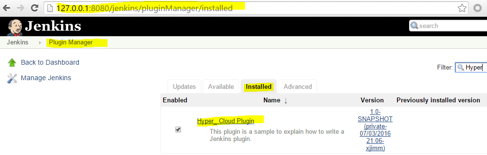

若安装其他插件，可以设置proxy以加快下载速度  
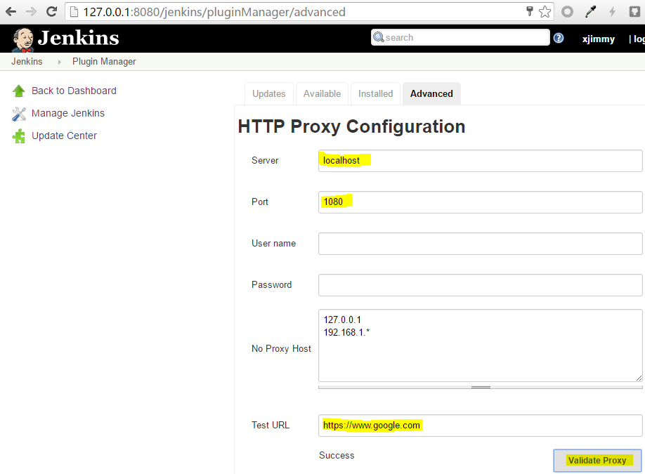


### 配置插件

Manage Jenkins -> Configure System  
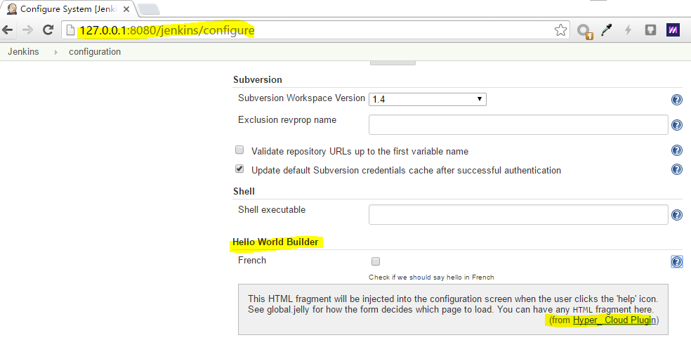

### 使用插件

Create New job  
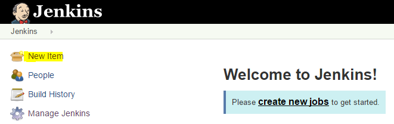

Set Job name and type  
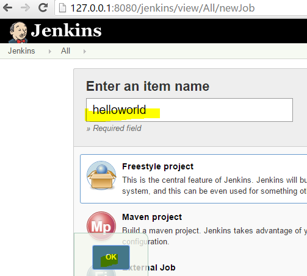

Add Build step  
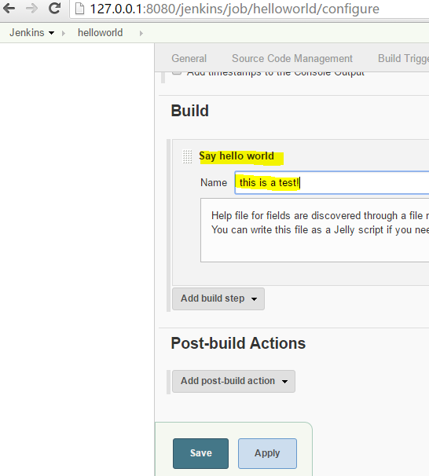

Trigger build by manual  
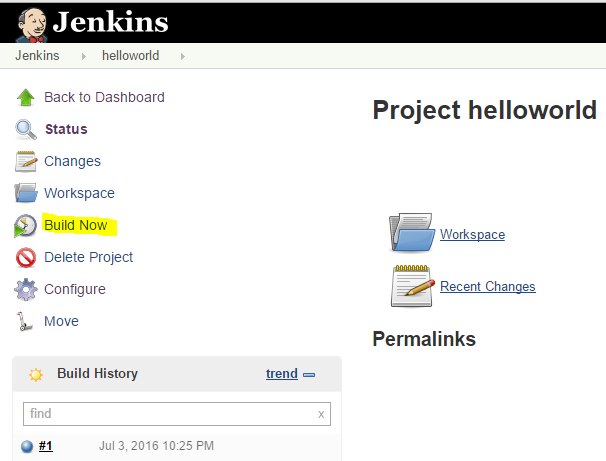

View build result in Console Output  
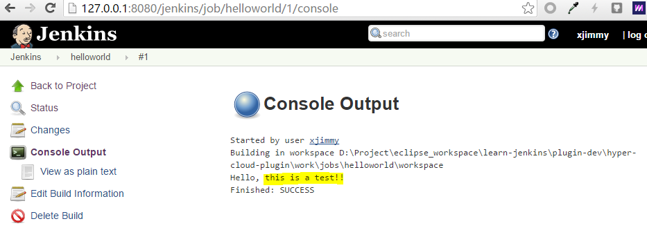


### 查看插件源码

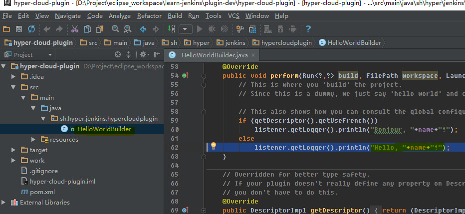
