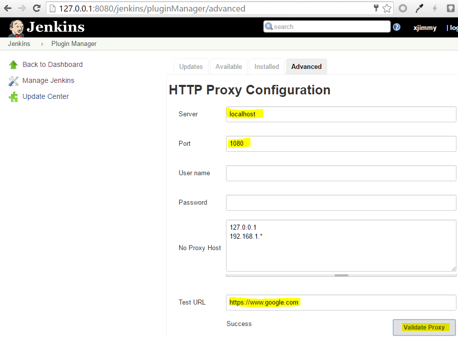

Jenkins插件开发
==============

- [开发环境需求](#开发环境需求)
	- [安装 JDK 1.8](#安装-jdk-18)
	- [安装 Maven 3](#安装-maven-3)
- [开发步骤](#开发步骤)
	- [步骤1: 设置Maven环境](#步骤1-设置maven环境)
	- [步骤2: 生成插件框架](#步骤2-生成插件框架)
	- [步骤3：IntelliJ IDEA中打开项目](#步骤3intellij-idea中打开项目)
	- [步骤4: 修改pom.xml](#步骤4-修改pomxml)
	- [步骤5: 测试编译，打包及安装](#步骤5-测试编译打包及安装)
		- [编译](#编译)
		- [测试](#测试)
		- [打包](#打包)
		- [安装](#安装)
- [调试插件](#调试插件)
	- [启动Jenkins服务](#启动jenkins服务)
	- [Jenkins Web UI](#jenkins-web-ui)
		- [初始化](#初始化)
		- [查看已安装插件](#查看已安装插件)
	- [配置插件](#配置插件)
	- [使用插件](#使用插件)
	- [查看插件源码](#查看插件源码)


以创建`hyper-commons-plugin`为例


# 开发环境需求

- CentOS 7.2.1511
- install JDK 1.8
- install maven 3

## 安装 JDK 1.8
```
$ curl -L -O -H "Cookie: oraclelicense=accept-securebackup-cookie" -k https://edelivery.oracle.com/otn-pub/java/jdk/8u91-b14/jdk-8u91-linux-x64.rpm
$ sudo yum install -y jdk-8u91-linux-x64.rpm
$ java -version
java version "1.8.0_91"
Java(TM) SE Runtime Environment (build 1.8.0_91-b14)
Java HotSpot(TM) 64-Bit Server VM (build 25.91-b14, mixed mode)

//switch java version when multiple version installed
$ sudo alternatives --config java
```

## 安装 Maven 3
```
$ sudo wget http://repos.fedorapeople.org/repos/dchen/apache-maven/epel-apache-maven.repo -O /etc/yum.repos.d/epel-apache-maven.repo
$ sudo yum install -y apache-maven
$ mvn --version
Apache Maven 3.3.9 (bb52d8502b132ec0a5a3f4c09453c07478323dc5; 2015-11-11T00:41:47+08:00)
Maven home: /usr/share/apache-maven
Java version: 1.8.0_91, vendor: Oracle Corporation
Java home: /usr/lib/jvm/java-1.8.0-openjdk-1.8.0.91-0.b14.el7_2.x86_64/jre
Default locale: en_US, platform encoding: UTF-8
OS name: "linux", version: "3.10.0-327.el7.x86_64", arch: "amd64", family: "unix"
```

[FAQ 1] Error "conflicts with file from package"
```
Transaction check error:
  file /usr/share/java/plexus/plexus-cipher.jar from install of apache-maven-0:3.3.9-1.el7eng.noarch conflicts with file from package plexus-cipher-1.7-5.el7.noarch
  ...
```
**原因**: `yum install maven` 与 `yum install apache-maven` 有冲突
**解决**:
```
$ sudo rpm -e maven maven-wagon aether-connector-wagon plexus-cipher plexus-sec-dispatcher
```

# 开发步骤

REF: [Jenkins插件开发官方教程](https://wiki.jenkins-ci.org/display/JENKINS/Plugin+tutorial)

## 步骤1: 设置Maven环境

add the following to your `~/.m2/settings.xml` (Windows users will find them in `%USERPROFILE%\.m2\settings.xml`):
```
<settings>
  <pluginGroups>
    <pluginGroup>org.jenkins-ci.tools</pluginGroup>
  </pluginGroups>

  <profiles>
    <!-- Give access to Jenkins plugins -->
    <profile>
      <id>jenkins</id>
      <activation>
        <activeByDefault>true</activeByDefault> <!-- change this to false, if you don't like to have it on per default -->
      </activation>
      <repositories>
        <repository>
          <id>repo.jenkins-ci.org</id>
          <url>http://repo.jenkins-ci.org/public/</url>
        </repository>
      </repositories>
      <pluginRepositories>
        <pluginRepository>
          <id>repo.jenkins-ci.org</id>
          <url>http://repo.jenkins-ci.org/public/</url>
        </pluginRepository>
      </pluginRepositories>
    </profile>
  </profiles>
  <mirrors>
    <mirror>
      <id>repo.jenkins-ci.org</id>
      <url>http://repo.jenkins-ci.org/public/</url>
      <mirrorOf>m.g.o-public</mirrorOf>
    </mirror>
  </mirrors>
</settings>
```

## 步骤2: 生成插件框架


命令行下执行：
```
$ mvn -U org.jenkins-ci.tools:maven-hpi-plugin:create
```  


生成后的插件框架由如下部分组成:
- pom.xml
- src/main/java
- src/main/resources
- src/main/webapp

### pom.xml
Maven使用pom.xml来构建插件.所有Jenkins插件都基于如下POM：
```
<parent>
    <groupId>org.jenkins-ci.plugins</groupId>
    <artifactId>plugin</artifactId>
    <version>2.3</version>
</parent>
```

### src/main/java
插件的Java源码

### src/main/resources
插件的Jelly/Groovy视图

### src/main/webapp
插件的静态资源，例如图像或者HTML文件


## 步骤3：IntelliJ IDEA中打开项目


## 步骤4: 修改pom.xml
修改如下
```
<name>TODO Plugin</name>
<description>TODO</description>
<url>https://wiki.jenkins-ci.org/display/JENKINS/TODO+Plugin</url>
```
为
```
<name>Hyper_ Commons Plugin</name>
<description>Hyper_ Commons Plugins for Jenkins</description>
<url>https://wiki.jenkins-ci.org/display/JENKINS/Hyper_+Commons+Plugin</url>
```

修改如下
```
  <jenkins.version>1.625.3</jenkins.version>
  <java.level>7</java.level>
```
为
```
  <jenkins.version>2.11</jenkins.version>
  <java.level>8</java.level>
```


> 修改pom.xml后，若IntelliJ IDEA弹出如下提示，则点击"Enable Auto-Import"  


## 步骤5: 测试编译，打包及安装

- 编译：`mvn compile`
- 测试：`mvn test`
- 打包：`mvn package`
- 安装：`mvn install`

### 编译

编译但不生成结果
```
$ mvn compile
...
[INFO] ------------------------------------------------------------------------
[INFO] Building Hyper_ Commons Plugin 1.0-SNAPSHOT
[INFO] ------------------------------------------------------------------------
...
[INFO] ------------------------------------------------------------------------
[INFO] BUILD SUCCESS
[INFO] ------------------------------------------------------------------------
```

### 测试

在编译基础上，多了运行测试用例(`src/test/java`)
```
$ mvn test
...
-------------------------------------------------------
 T E S T S
-------------------------------------------------------
...
```

### 打包

在`mvn test`基础上，多了生成`*.hpi`文件到项目的`target`子目录下
```
$ mvn package
...
[INFO] Assembling webapp hypercommons in /home/xjimmy/hyper-commons-plugin/target/hypercommons
[INFO] Generating hpi /home/xjimmy/hyper-commons-plugin/target/hypercommons.hpi
[INFO] Building jar: /home/xjimmy/hyper-commons-plugin/target/hypercommons.hpi
...
```

#### [FAQ 1] Error "The version cannot be empty"
**错误信息**：  
```
[INFO] ------------------------------------------------------------------------
[INFO] BUILD FAILURE
[INFO] ------------------------------------------------------------------------
...
[ERROR] Failed to execute goal org.codehaus.mojo:animal-sniffer-maven-plugin:1.14:check (check) on project hypercommons:
Execution check of goal org.codehaus.mojo:animal-sniffer-maven-plugin:1.14:check failed:
For artifact {org.codehaus.mojo.signature:java18:null:signature}: The version cannot be empty. -> [Help 1]
```
**原因**： 参考https://groups.google.com/forum/#!msg/jenkinsci-dev/IUHxT8CR6Es/c048VccGBQAJ  
**解决**：  
```
修改pom.xml，将
<java.level>8</java.level>
改回为
<java.level>7</java.level>
```


#### [FAQ 2] Error "Failed to execute goal org.apache.maven.plugins:maven-surefire-plugin:2.18.1"
**错误信息**：  
```
[INFO] ------------------------------------------------------------------------
[INFO] BUILD FAILURE
[INFO] ------------------------------------------------------------------------
...
[ERROR] Failed to execute goal org.apache.maven.plugins:maven-surefire-plugin:2.18.1:test (default-test) on project hypercommons:
There are test failures.
[ERROR]
[ERROR] Please refer to /home/xjimmy/hyper-commons-plugin/target/surefire-reports for the individual test results.
[ERROR] -> [Help 1]
```
**原因**：测试用例为空  
**解决**: 跳过测试用例  
```
//跳过测试
$ mvn package -DskipTests
```

### 安装

在`mvn package基础上`，多了复制`hpi`到本地仓库下：
```
$ mvn install
...
[INFO] --- maven-install-plugin:2.5.2:install (default-install) @ hypercommons ---
[INFO] Installing /home/xjimmy/hyper-commons-plugin/target/hypercommons.hpi to
 /home/xjimmy/.m2/repository/sh/hyper/plugins/hypercommons/1.0-SNAPSHOT/hypercommons-1.0-SNAPSHOT.hpi
[INFO] Installing /home/xjimmy/hyper-commons-plugin/pom.xml to
 /home/xjimmy/.m2/repository/sh/hyper/plugins/hypercommons/1.0-SNAPSHOT/hypercommons-1.0-SNAPSHOT.pom
[INFO] Installing /home/xjimmy/hyper-commons-plugin/target/hypercommons.jar to
 /home/xjimmy/.m2/repository/sh/hyper/plugins/hypercommons/1.0-SNAPSHOT/hypercommons-1.0-SNAPSHOT.jar
...
```

#### [FAQ 1] Error "Failed to execute goal org.apache.maven.plugins:maven-surefire-plugin:2.18.1"
**解决**：与mvn package相同处理，跳过测试用例
```
$ mvn install -DskipTests
```


# 调试插件

使用`mvn hpi:run`可以启动一个本地Jenkins Server，以便于开发调试.

## 启动Jenkins服务

设置环境变量`MAVEN_OPTS`
```
$ export MAVEN_OPTS="-Xdebug -Xrunjdwp:transport=dt_socket,server=y,address=8000,suspend=n"
```

如果`pom.xml`中，`jenkins.version`指定为`1.651.3`
```
$ mvn hpi:run
...
[INFO] Started SelectChannelConnector@0.0.0.0:8080
[INFO] Started Jetty Server
[INFO] Console reloading is ENABLED. Hit ENTER on the console to restart the context.
Started initialization
: Listed all plugins
: Prepared all plugins
: Started all plugins
: Augmented all extensions
: Loaded all jobs
: Started SSHD at port 64524
: Started Download metadata
: Completed initialization
: Jenkins is fully up and running
...
```

如果`pom.xml`中，`jenkins.version`指定为`2.11`
```
$ mvn hpi:run
...
Jenkins initial setup is required. An admin user has been created and a password generated.
Please use the following password to proceed to installation:

a2b54ccfd545438d90dfbcf8cadb4c7a

This may also be found at: /home/xjimmy/hyper-commons-plugin/work/secrets/initialAdminPassword

*************************************************************
*************************************************************
*************************************************************
: Obtained the updated data file for hudson.tools.JDKInstaller
: Finished Download metadata. 4,308 ms
: Obtained the latest update center data file for UpdateSource default
: Jenkins is fully up and running
...
```


## Jenkins Web UI

浏览器中打开：`http://127.0.0.1:8080/jenkins/`,

### 初始化

- 如果`jenkins.version`指定为`1.651.3`,则无需初始化即可使用
- 如果`jenkins.version`指定为`2.11`，则需要先使用上述`initial admin password`进行初始化，完成后可以使用

### 查看已安装插件

查看已安装插件: `Manage Jenkins -> Manage Plugins -> Installed`, 可以看到`Hyper_ Build Step Plugin`插件已安装  


若安装其他插件，可以设置proxy以加快下载速度  



## 配置插件

Manage Jenkins -> Configure System  


## 使用插件

Create New job  


Set Job name and type  


Add Build step  


Trigger build by manual  


View build result in Console Output  


## 查看插件源码


